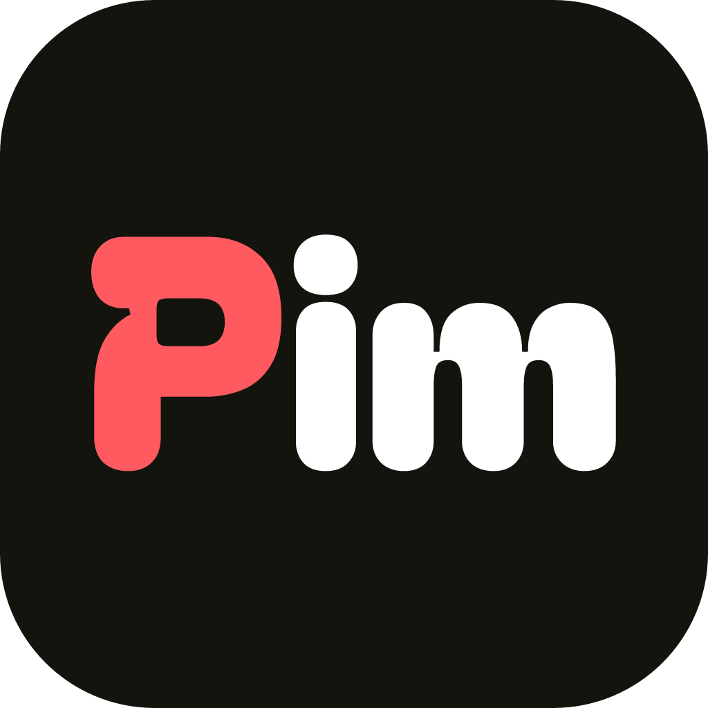
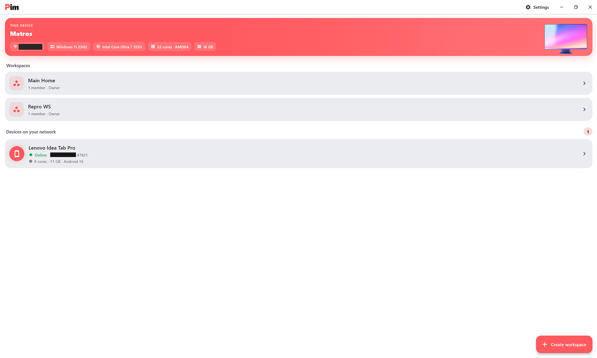

<div align="center">



# PIM

**Your devices, talking directly — no servers, no cloud, no accounts.**

Send files, text, notes and tasks between your own phone and PC over the same
Wi‑Fi. Everything stays on your network.

[](https://github.com/deadseti/pim/releases/latest)


</div>

<p align="center">
  
</p>

---

## What it is

PIM turns the devices you already own into a tiny private network. Open it on
your laptop and your phone while they're on the same Wi‑Fi, and they find each
other on their own — no pairing codes, no sign‑up, no third‑party server sitting
in the middle. From there you can throw files across, jot shared notes, keep a
task board, or just chat.

I built it because moving a file from my phone to my PC shouldn't require a
cloud round‑trip, a cable, or a messenger app that recompresses my photos. If
two devices are on the same network, they should just talk.

## Download

Grab a ready‑to‑run build from the
[**Releases**](https://github.com/deadseti/pim/releases/latest) page:

- **Windows** — download the `.zip`, unzip it anywhere, run `PIM.exe`.
- **Android** — download and install the `.apk` (Android 6.0+).

Or build it from source — see [Getting started](#getting-started).

## Features

- **Automatic discovery** — every device announces itself on the LAN and builds
  a live list of who's online. Nothing to configure.
- **Direct messaging** — a simple chat with each device you find.
- **Workspaces** — shared spaces you invite other devices into. Membership,
  folders and content stay in sync across everyone in the space.
- **File transfer that you can trust** — files are streamed in chunks with a
  running SHA‑256 hash and verified on arrival, so a transfer is either correct
  or it fails loudly. Live progress per transfer.
- **Folders** — organise a workspace into nested folders, list or grid view.
- **Notes** — a full‑screen editor with list and sticky‑note grid views.
- **Tasks** — categories, descriptions and a status you can flip, shown as a
  list or a drag‑and‑drop **Kanban board**.
- **Statistics** — a quick visual breakdown of what's in a workspace.
- **Built‑in previews** — images, video and audio open right inside the app.
- **Desktop niceties** — drag files in from Explorer, paste with Ctrl+V, and a
  clean custom window chrome.
- **Bilingual** — English and Ukrainian, with light / dark / system themes.
- **Persistent** — everything is stored locally in SQLite and survives restarts.

## How it works

There's no central server. Every device is both a client and a server, and the
whole thing is plain Dart so Windows and Android behave identically.

1. **Discovery** — each device broadcasts a small UDP packet (id, name,
   platform, TCP port) across the subnet every couple of seconds on port
   **47820**. Everyone listening keeps a live roster of online peers.
2. **Transport** — when you send something, the app opens a persistent **TCP**
   connection (port **47821**, or an OS‑assigned fallback if it's taken) to the
   target and reuses it. A short `hello` handshake maps each socket back to a
   logical device id.
3. **Framing** — every message is length‑prefixed (4‑byte big‑endian length +
   payload) so discrete messages survive TCP's byte‑stream nature. File chunks
   and control messages share the same framing with a one‑byte kind tag.

| Port  | Protocol | Purpose                                             |
|-------|----------|-----------------------------------------------------|
| 47820 | UDP      | Discovery broadcast / listen                        |
| 47821 | TCP      | Peer connections (falls back to a free port if busy)|

> On Windows the first launch triggers a Firewall prompt — **allow it on private
> networks** so other devices can reach this one.

## Getting started

You'll need the [Flutter SDK](https://docs.flutter.dev/get-started/install).

```bash
git clone https://github.com/deadseti/pim.git
cd pim
flutter pub get
flutter gen-l10n        # generates the localization sources

# Windows
flutter run -d windows

# Android (phone on the same Wi-Fi as the PC)
flutter run -d <android-device-id>
```

To see it do its thing you need **two devices on the same Wi‑Fi** — say this PC
and an Android phone, or two PCs. Each shows up as a card on the other, and
you're off.

### Building releases

```bash
flutter build windows     # build/windows/x64/runner/Release
flutter build apk         # build/app/outputs/flutter-apk/app-release.apk
```

## Tech stack

Flutter · Dart · `provider` for state · `sqlite3` for storage · `media_kit` for
media playback · `window_manager` for the custom desktop window ·
`desktop_drop` + `pasteboard` for drag‑and‑drop and paste. Discovery, transport
and framing are hand‑rolled in pure Dart — no networking plugins.

## Project layout

```
lib/
  main.dart                 App entry: identity, network, providers, run
  app.dart                  MaterialApp, Material 3 theme, EN/UK localization
  core/                     Platform helpers + wire protocol (framing, messages)
  models/                   Devices, workspaces, folders, files, notes, tasks
  services/                 Discovery, transport, network facade, workspace &
                            file‑transfer managers, SQLite database, identity
  state/                    App controller (single UI source of truth)
  ui/                       Screens & widgets (home, workspace, chat, editors…)
  l10n/                     English / Ukrainian translations
```

## Roadmap

- Device pairing / trust and end‑to‑end encryption
- Background service on Android so transfers keep going
- Content‑addressed cache and de‑duplication

## License

MIT — see [LICENSE](LICENSE). Do what you like with it.

---

<div align="center">
Made by <a href="https://github.com/deadseti">MATROS&nbsp;DEV</a>
</div>
